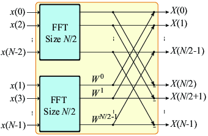
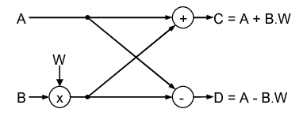
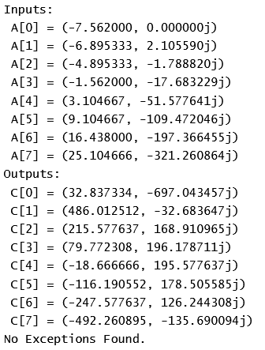
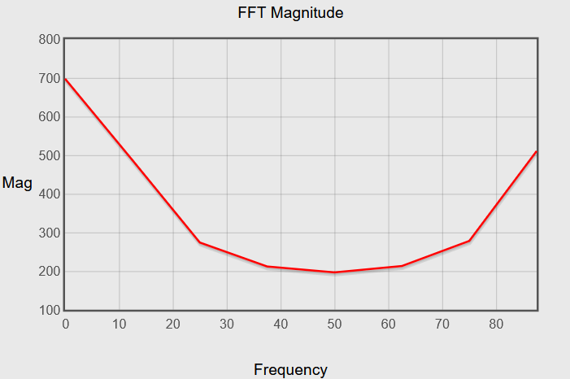
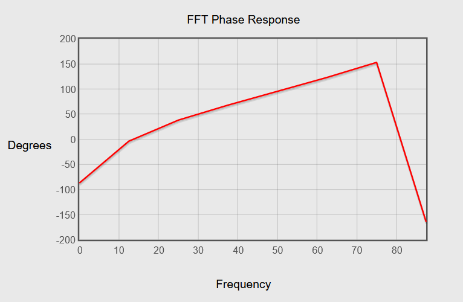

# Floating-Point-FFT-Verilog-Implementation
Fast Fourier Transform (FFT) using the Decimation-In-Time (DIT) algorithm and Floating-Point Arithmetic, implemented in Verilog.

#### Why Floating Point?
This implementation demonstrates the need for floating-point representation over integers. In digital signal processing, especially for FFTs, floating-point arithmetic provides the precision required to handle a wide range of values and operations. The 8-point FFT, in particular, showcases how floating-point can manage the nuances of fractional numbers as it is needed to represent the twiddle factors.


#### Design Overview



This implementation leverages the Cooley–Tukey FFT algorithm, one of the most efficient and widely-used methods for computing the FFT. The Focus was on the 8-point FFT as it is the first to show the need for the Floating-Point representation.

#### Modules
`fft8`

The `fft8` module performs the 8-point FFT using floating-point arithmetic. It is built upon the Cooley–Tukey algorithm and handles complex input data effectively.
```
 module fft8 (
  input [num_p-1:0][31:0] A_r, A_i, W_r, W_i,
  output [num_p-1:0][31:0] C_r, C_i,
  output Exception
);
  // FFT8 implementation
endmodule
```

`rad2_bf`

The Radix-2 Butterfly Unit handles complex multiplications and accumulations using floating-point arithmetic.


```
module rad2_bf (
  input [31:0] A_r, A_i, B_r, B_i, W_r, W_i,
  output [31:0] C1_r, C1_i, C2_r, C2_i,
  output Exception
);
  // Radix-2 Butterfly Unit implementation
endmodule
```

`mul`

The `mul` module performs floating-point multiplication.

```
module mul (
  input [31:0] M1, M2,
  output [31:0] P,
  output Exception
);
  // Floating-Point Multiplication implementation
endmodule
```

`acc`

The `acc` module handles floating-point accumulation.
```
module acc (
  input [31:0] M1, M2,
  output reg [31:0] Out,
  output reg Exception
);
  // Floating-Point Accumulation implementation
endmodule

```

#### Testbenches
* `tb`

The `tb` module tests the `fft8` implementation by generating input values, assigning twiddle factors, and displaying the results.

* `mul_tb`

The `mul_tb` module tests the `mul` unit with various input values to cover different scenarios and edge cases.

* `acc_tb`

The `acc_tb` module validates the `acc` unit with a range of test values to ensure correct floating-point addition and exception handling.


#### Simulation Snippet
Log Output 



Graphs of the Output using SciStatCalc FFT calculator





#### For A Better View of Simulation Results, Check The Following EdaPlayground:
   https://edaplayground.com/x/kBkR

#### Contact
For any questions or collaborations, please reach out to my LinkedIn Profile: [Sameh ELbatsh](https://www.linkedin.com/in/sameh-elbatsh)

